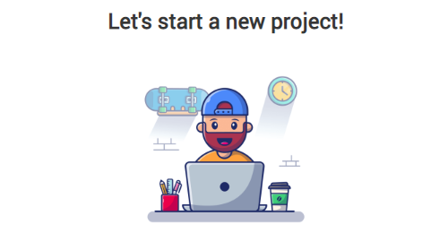

  

<h1 align="center">
  "Webpack" template
</h1>

  
  
  
  
    

## Description:

Webpack assembly for automating workflows  
in project development

## Documentation

**Scripts:**
- `npm start` - start the project and the server
- `npm run dev` - assemble the project in development mode
- `npm run build` - assemble the project in production mode
- `npm run clear` - delete directory `dist`
- `npm run deploy` - deployment to gh-pages

**Use npm commands for install node modules:**
- `npm i` - install this **webpack** template
- `npm webpack webpack-cli -D` - install webpack and webpack-cli to work with webpack
- `npm i webpack-dev-server` - install local webpack server
- `npm i html-webpack-plugin -D` - install plugin to compile html files to production
- `npm i html-loader -D` - automatic update of html files on the local server
- `npm i css-loader -D` - automatic update of css files on the local server
- `npm i style-loader -D` - install styles from js
- `npm i mini-css-extract-plugin -D` - this plugin extracts CSS into separate files
- `npm i sass-loader sass -D` - loads a Sass/SCSS file and compiles it into CSS
- `npm i postcss-loader postcss postcss-preset-env -D` - adds prefixes to css rules for old browser versions
- `npm i babel-loader @babel/core @babel/preset-env -D` - compiles the latest js standard to the standard for old browser versions
- `npm i --save @babel/polyfill` - improve our babel :)
- `npm i image-webpack-loader -D` - image optimization module
- `npm i gh-pages -D` - module for project deployment on gh-pages

## Developers

- [Ihor Kuchin](https://github.com/ik-web)
